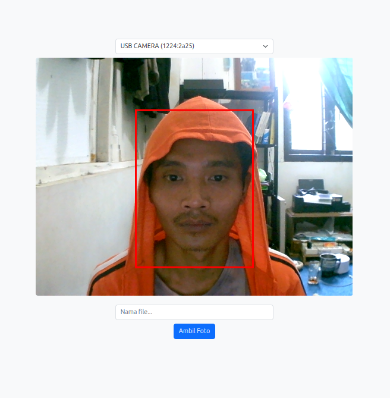
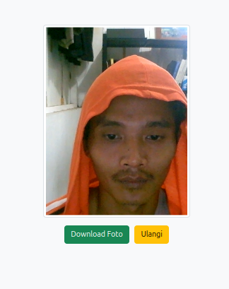
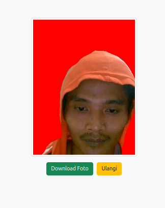
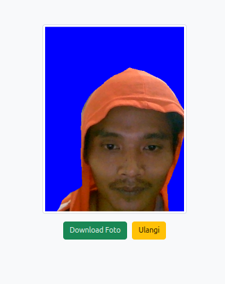

# Webcam Frame 3x4 dengan Green Screen

Aplikasi ini adalah sebuah web berbasis HTML, JavaScript, dan Bootstrap 5 yang memungkinkan pengguna untuk mengambil foto dengan frame ukuran 3x4, memilih kamera yang digunakan, serta mengganti background secara otomatis dengan pilihan warna merah atau biru.

## Fitur Utama
- Menampilkan video dari webcam dengan resolusi penuh.
- Menampilkan frame 3x4 sebagai panduan pengambilan foto.
- Memungkinkan pengguna memilih kamera yang ingin digunakan.
- Menghapus background menggunakan teknologi machine learning (BodyPix) dan menggantinya dengan warna solid (merah atau biru). [Remove Background](https://cantrik-art.github.io/project-kamera-kts/greedscreen.html)
- Menyediakan input untuk memasukkan nama file sebelum mengambil foto.
- Menampilkan preview sebelum mendownload hasil foto.
- Memungkinkan pengguna mengulang proses jika hasil tidak sesuai.
- Hasil foto otomatis dipotong sesuai ukuran frame 3x4 sebelum diunduh.

## Cara Menggunakan
1. Buka halaman aplikasi di browser yang mendukung akses kamera.
2. Pilih kamera yang ingin digunakan dari dropdown.
3. Masukkan nama file untuk menyimpan hasil foto.
4. Pilih warna background yang diinginkan (Merah atau Biru).
5. Klik tombol **"Ambil Foto"** untuk mengambil gambar.
6. Periksa preview hasil foto yang telah diproses.
7. Jika hasil sudah sesuai, klik **"Download Foto"**.
8. Jika ingin mengambil ulang, klik **"Ulangi"** dan ulangi langkah sebelumnya.

## Teknologi yang Digunakan
- **HTML5 & CSS3**: Untuk struktur dan styling aplikasi.
- **Bootstrap 5**: Untuk desain yang responsif dan menarik.
- **JavaScript**: Untuk logika pengambilan gambar dan pengolahan data.
- **TensorFlow.js & BodyPix**: Untuk mendeteksi dan menghapus background secara otomatis.

## Screenshot Aplikasi
Berikut adalah tampilan dari aplikasi:

### 1. Tampilan Awal


### 2. Setelah Mengambil Foto


### 3. Hasil Foto dengan Background Merah


### 4. Hasil Foto dengan Background Biru


## Instalasi & Penggunaan Lokal
1. Clone repositori ini:
   ```bash
   git clone https://github.com/Cantrik-art/project-kamera-kts.git
   ```
2. Buka file `index.html` di browser.
3. Pastikan browser memiliki izin untuk mengakses kamera.
4. Gunakan aplikasi sesuai panduan di atas.

## Lisensi
Aplikasi ini dirilis dengan lisensi MIT. Bebas digunakan dan dimodifikasi sesuai kebutuhan.

---

Selamat menggunakan aplikasi! 🚀

